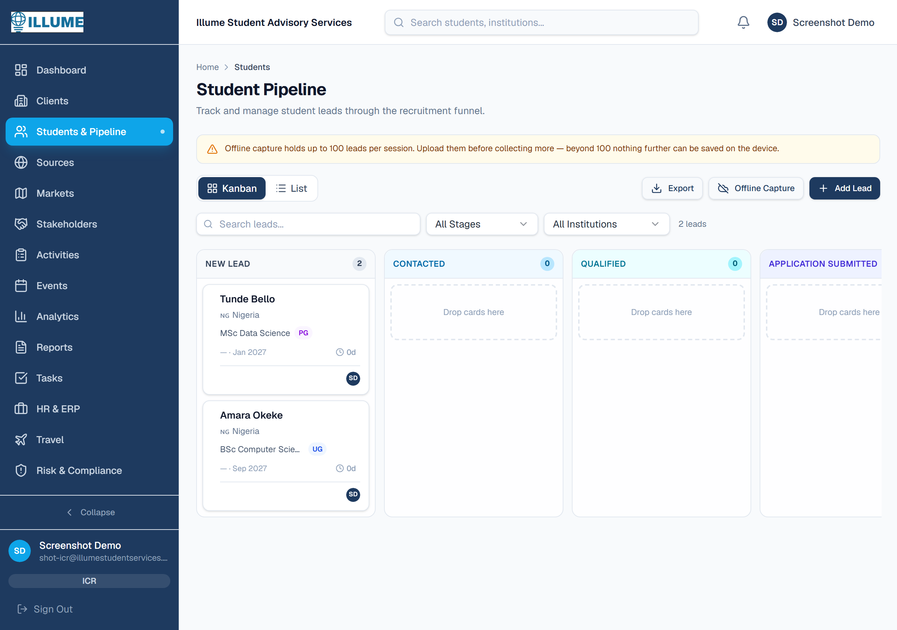
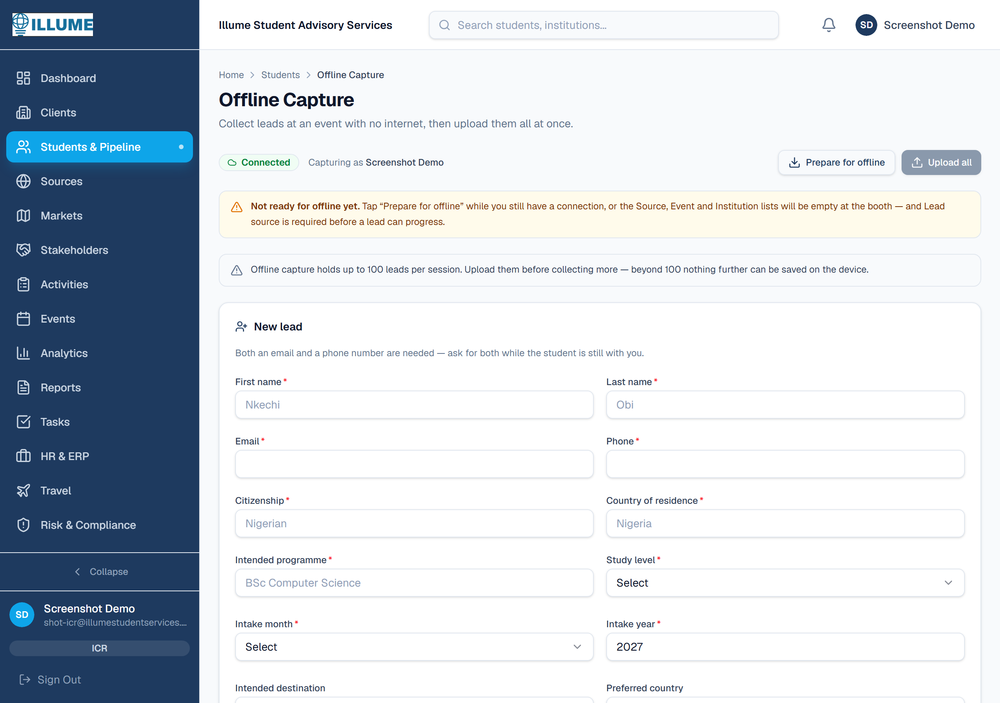
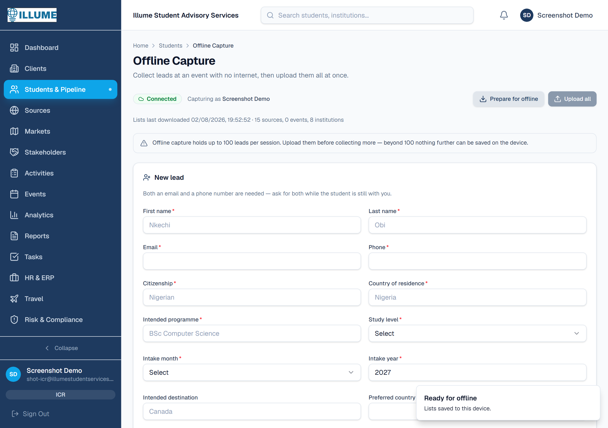
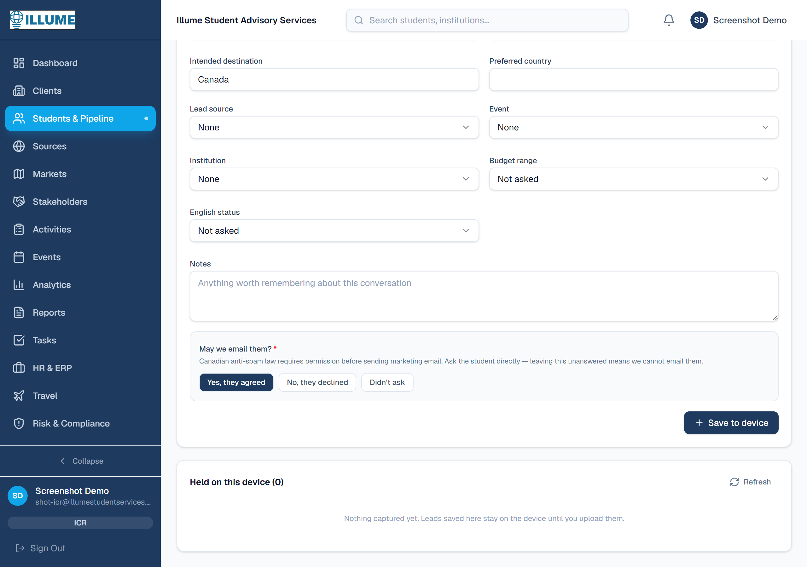
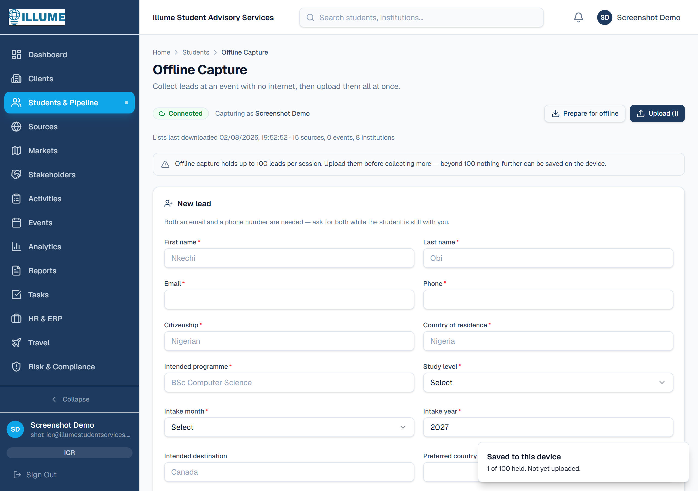
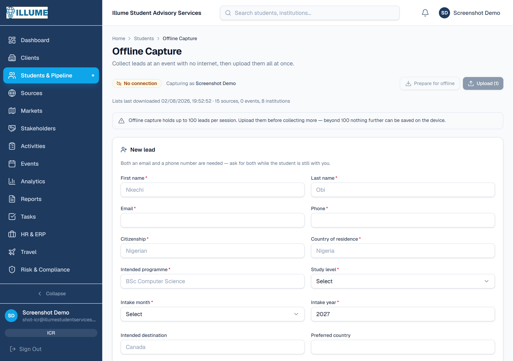
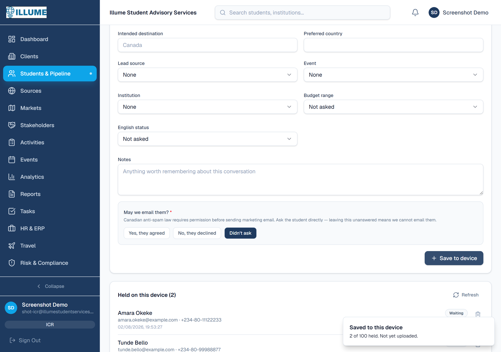
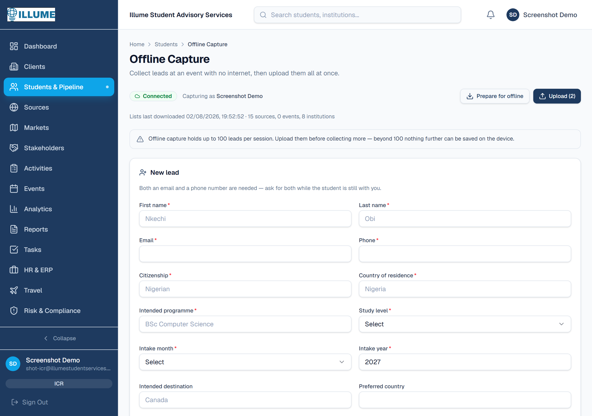
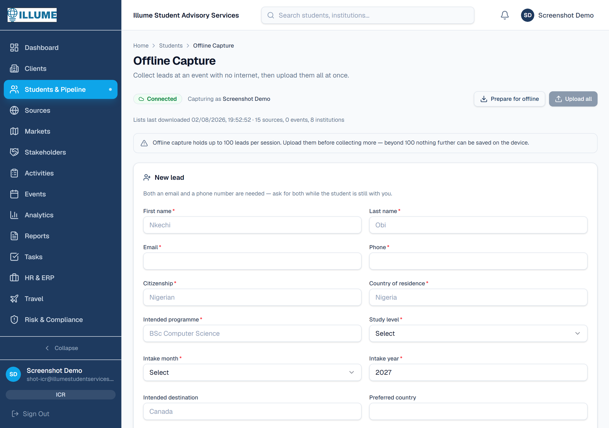

# Offline Lead Capture

Collect student leads at an event with no internet, then upload them all with
one button when you're back online.

Live at **Students & Pipeline → Offline Capture** (`/students/offline`).

Screenshots below are of the real system, captured against production.

---

## For ICRs: using it at an event

### Before you travel — do this on wifi

Open **Students & Pipeline**, then **Offline Capture**.



The first time you open it, it will tell you it isn't ready:



Tap **Prepare for offline**. This downloads the Lead Source, Event and
Institution lists onto your device, and installs the page so it opens without a
signal.



You'll see when the lists were last downloaded. **Do this the day you travel** —
if the lists are weeks old, an event created since then won't be in the list.

> **This step is not optional.** Without it, Lead Source is empty at the booth —
> and Lead Source is one of the fields required before a lead can move past
> "New Lead". You'd capture students who then can't progress.

### At the booth

Fill in the form and tap **Save to device**. You need **both an email and a
phone number** — ask for both while the student is still with you.



Note the question at the bottom: **"May we email them?"** Canadian anti-spam law
requires permission before sending marketing email. There are three answers, and
they mean different things:

| Answer | Meaning |
|---|---|
| **Yes, they agreed** | You may email them |
| **No, they declined** | You must not email them |
| **Didn't ask** | Nobody asked — you can still ask later |

"Didn't ask" is not the same as "declined". Leave it honest.

Each lead is saved onto the phone:



### With no signal

Everything works the same. The badge at the top changes to **No connection**,
and **Upload** is disabled until you're back online.



Keep capturing. The counter next to Upload shows how many are waiting.



### Back on wifi

The badge returns to **Connected** and Upload becomes available.



Tap **Upload**. The device clears and the leads are in the CRM.



---

## Things to know

**Up to 100 leads per session.** At 100 the form stops accepting new ones until
you upload. Not a technical limit — a limit on how much unsent work sits in one
place, because a lost phone loses all of it.

**Upload before the end of each day** if you can. Leads only exist on that one
device until they're uploaded.

**If the upload is interrupted, just press it again.** Every lead carries a
hidden ticket number, so leads that already arrived are recognised and skipped
rather than created twice.

**One bad record won't block the rest.** Each lead is sent separately. Failures
stay on the device with a note explaining what's wrong, so you can fix and
resend just those. Everything else uploads normally.

**Nothing is deleted from the device until the server confirms it.** If the
upload fails, nothing is removed and you'll be told so.

**If you're signed out mid-upload**, sign in and press Upload again. Nothing is
lost — sessions expire after 48 hours and an event can outlast that.

**Don't use a private/incognito window.** Offline storage is blocked there. The
page refuses to run rather than appearing to work and losing everything on
close.

---

## For developers

### Where things live

| Path | Purpose |
|---|---|
| `app/(dashboard)/students/offline/page.tsx` | Route |
| `.../offline/_components/offline-capture-client.tsx` | The capture screen |
| `.../offline/_components/register-offline-worker.tsx` | Installs the service worker |
| `lib/offline-queue.ts` | IndexedDB queue |
| `lib/offline-capture.ts` | The 100 limit and its warning text |
| `lib/lead-options.ts` | Dropdown options, shared with the online form |
| `app/api/leads/offline-sync/route.ts` | Batch upload |
| `app/api/leads/offline-reference/route.ts` | Dropdown data download |
| `public/sw.js` | Service worker |
| `prisma/manual/010-offline-capture.sql` | `Lead.captureId` |
| `prisma/manual/011-marketing-consent.sql` | Consent columns |

### Design decisions worth not undoing

**`Lead.captureId` is a unique idempotency key**, generated on the device at
capture. The upload endpoint checks it before inserting, and the unique index
backs that up against a race. The existing duplicate detection only *flags*
`isDuplicate` after the fact — it does not prevent the row. Without `captureId`,
a retried upload creates every already-delivered lead a second time.

**The upload endpoint is deliberately not one transaction.** A batch is a
hundred independent students; wrapping them together means one malformed row
discards ninety-nine good ones. Each is attempted alone and reported
individually as `created` / `already_synced` / `failed`.

**The device deletes only what the server confirms.** Anything not mentioned in
the response stays put. The device is the only copy.

**Validation on the device mirrors the server exactly**, both email and phone
included. A looser check would queue leads that can only fail on upload hours
later, with the student long gone.

**`marketingConsent` is `Boolean?`, three-valued.** `NULL` means nobody asked;
`false` means asked and declined. A boolean defaulting to `false` collapses
those, and under CASL that distinction is the entire point. Migration 011 does
not back-fill for the same reason.

**The service worker is deliberately narrow.** It touches the capture page
document and `/_next/static/*` and nothing else — never `/api/`, never other
navigations, never non-GET. It caches only 200 responses, so it cannot pin the
`/login` redirect in place of the page. It is registered from the capture page
alone, not the root layout, so it installs only for people who attend events.

> **Kill switch.** A service worker lives on the device and keeps misbehaving
> after you revert the deploy that caused it. To disable, replace the body of
> `public/sw.js` with:
> ```js
> self.addEventListener("install", () => self.registration.unregister());
> ```
> and deploy. Devices pick it up on their next visit.

**`proxy.ts` must keep excluding `sw.js`** from its matcher. The service worker
spec rejects a registration whose script request redirects, and every other path
through the proxy redirects a signed-out visitor to `/login`. Left in, the worker
silently fails to install with nothing in any server log — the request returns an
ordinary 307. Re-check with:

```
curl -sI https://illumestudentservices.cloud/sw.js | head -1   # must be 200
```

**Don't join template literals with `+` in `lib/offline-capture.ts`.** The limit
is a module-local constant, so the minifier folds `${OFFLINE_CAPTURE_LIMIT}` to
`100` — and while folding two `+`-joined literals it drops the static text
between the interpolation and the closing backtick. The banner shipped reading
*"holds up to 100Upload them before collecting more"*. TypeScript, eslint and the
build all passed. Keep it as one literal.

### Known gaps

- **No badge/QR scanning.** Most fairs issue scannable badges; typing is slower
  and more error-prone. Worth doing next.
- **Queue is not encrypted at rest.** Considered and deliberately deferred. Up to
  100 students' contact details sit on the device between uploads; a PIN lock is
  roughly half a day's work and can be added without redoing anything.
- **No screen for correcting a rejected lead.** Failures show their reason and
  can be deleted, but not edited in place.
